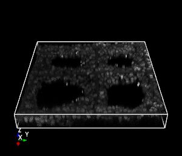
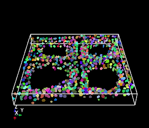

# The Scaffold-A549 Dataset

This repository contains scripts for inspection, preparation, and visualization of the Scaffold-A549 dataset. This  dataset consists of 20 unlabelled training images and one fully annotated test image, which is designed for unsupervised nuclei segmentation.

Dataset download are available at:  [Github](https://github.com/Kaiseem/Scaffold-A549/releases/download/v1.0/scaffold_a549.zip)

  

## News
- [2021/07/30] We release the Scaffold-A549 datasets.

## Dataset Generation
The A549 human non-small cell lung cancer cells were seeded in fibrous scaffolds and the nuclei of A549 cells are stained with Hoechst 33342 (blue) for Confocal laser scanning microscope (CLSM) imaging. Images of 3D cell cultures were captured with a EC Plan-Neofluar 20X/0.5 air immersion objective, using a CLSM system (LSM-880, ZEISS, Germany), and the scanning depth of the cell cultured scaffolds is set about 60$\mu m$ based on preliminary tests. The colected 21 CLSM images have the size of 1024 * 1024 on lateral plane and all the images are then spatial normalized, cropped and resized to the size of 512 * 512 * 64. Annotation was fully conducted on one of the images, and finally more than 800 nuclei are labelled.

## Scripts

### Installation

Install `mayavi` with `pip` for visualization
```
python -m pip install mayavi
```

### Visualization

````python
from visual_tools import volshow
import numpy as np

# visualize the test image
arr1=np.load(r'test\sf_a549_21.npy').transpose((1,2,0))[:,:,::-1]
volshow(arr1,label=False)

# visualize the ground truth
arr2=np.load(r'test\sf_a549_21_Label.npy').transpose((1,2,0))[:,:,::-1]
volshow(arr2,label=True)
````

## Contact

Please feel free to contact us with any questions, suggestions or comments:

* Kai Yao  (kai.yao19@student.xjtlu.edu.cn)

